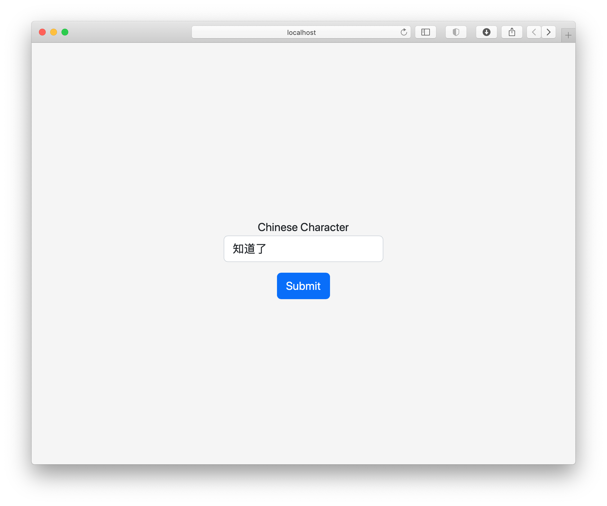
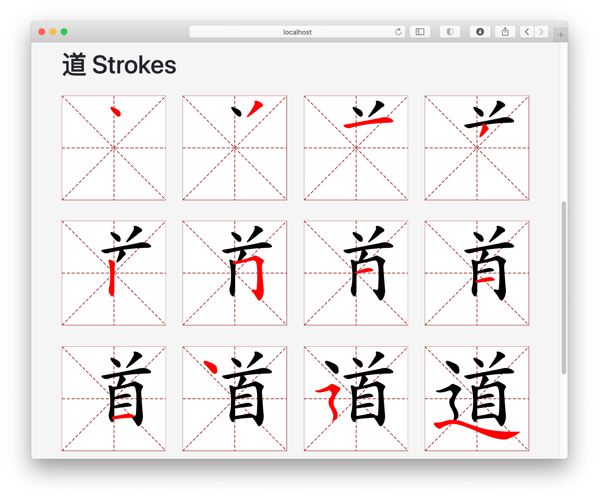
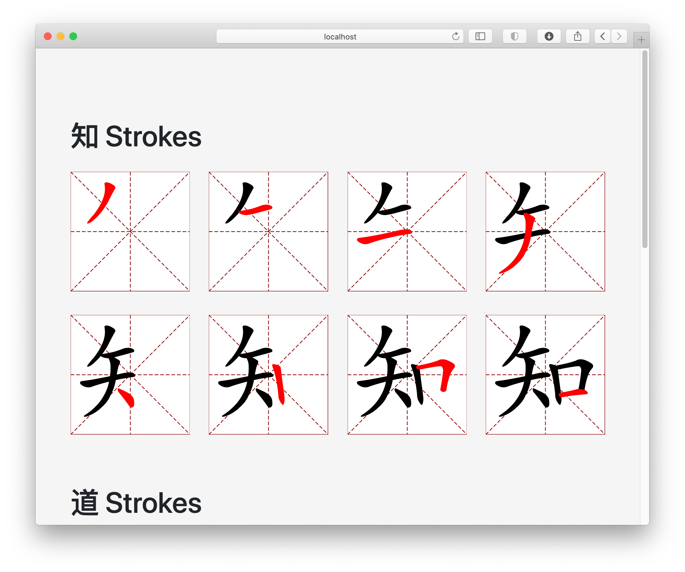
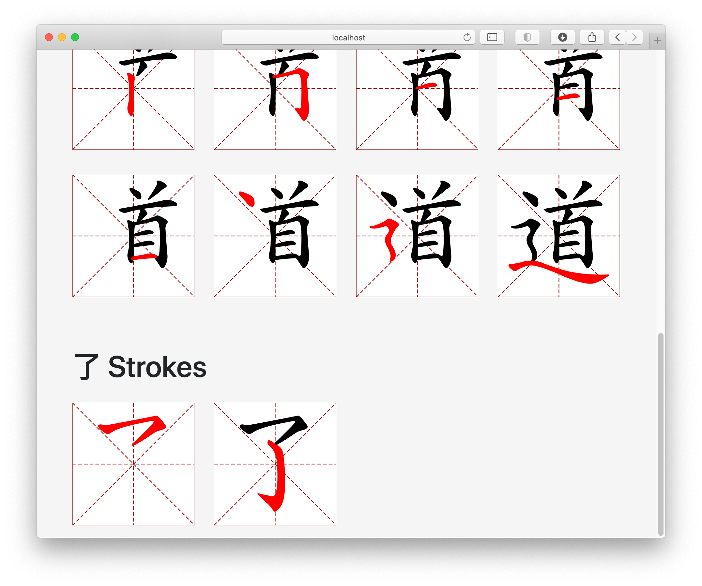
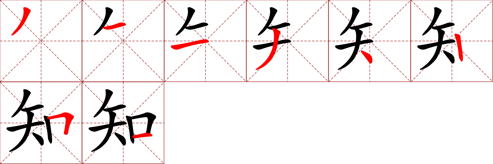

# pystrokes

This project generates grids showing the stroke order for Chinese characters. 
Many of the apps I've found for learning stroke order display an animation but
I found having a static image more useful.


You can either run a flask server that will display a form where you can input characters and then display the stroke orders on a web page or
you can generate the images locally on the command line

## Sources

__graphics.txt__ stroke data:

* Taken from the [makemeahanzi][1] project which was originally derived from two [Arphic Technology][2] fonts


[1]: https://github.com/skishore/makemeahanzi
[2]: http://www.arphic.com/


## Examples

__Web Examples__:







__Generating PNG Locally__

generated with the command `python3 pystrokes.py  知道了`




## Dependencies

Requires `cairo` to be installed for rendering the svgs to png

This is how I installed on macOS 12.6

```
conda install cairo pango gdk-pixbuf libffi
```


## Setup and Usage

Setup

```
python3 -m venv env
source env/bin/activate
python3 -m pip install -r requirements.txt
```


Start flask server with the command below then point your browser to `localhost:5000` or `127.0.0.1:5000`

```
$ python3 app.py
```


Generating images locally (this will create 3 images in the `strokes` directory):

```
$ python3 pystrokes.py  知道了
```

